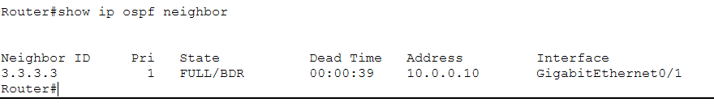
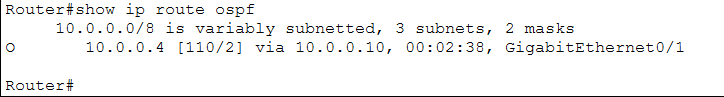
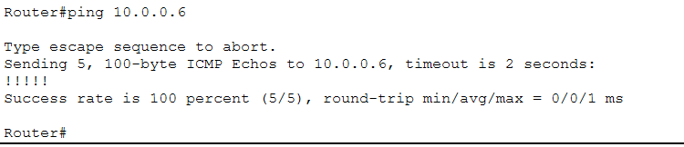
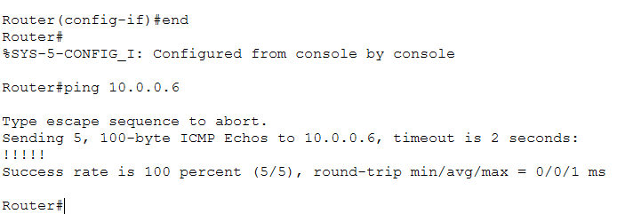

# Cisco Packet Tracer Networking Labs

A collection of progressively advanced networking labs built in Cisco Packet Tracer while studying Computer Networking.

## 📡 Network Simulation Portfolio

A hands-on networking lab series simulating small-to-medium enterprise network environments using Cisco Packet Tracer.

Focus areas include:
- LAN design and switching fundamentals
- Inter-VLAN routing and segmentation
- Network security policies (ACLs)
- WAN connectivity and routing behavior
- IPv4 address translation (NAT/PAT)
- Dynamic routing and link-state protocols (OSPF)
- Capstone: integrated enterprise network design (VLANs, firewall, NAT, ACLs)

## Lab Progression

| Lab Project | Concepts Covered | Date Completed | Topology |
| :--- | :--- | :--- | :--- |
| **Basic LAN** | Static IP, Layer 2 Switching | June 2026 | [View](images/basic-lan-topology.png) |
| **Secure SOHO** | Wireless, DHCP | June 2026 | [View](images/secure-soho-topology.png) |
| **Enterprise Gateway** | Default Gateways, L3 Routing | June 2026 | [View](images/enterprise-gateway-topology.png) |
| **Enterprise LAN/WAN** | ISP Connectivity, Public Routing | June 2026 | [View](images/enterprise-lan-wan-topology.png) |
| **VLAN & Inter-VLAN Routing** | 802.1Q Trunking, Sub-interfaces, ROAS | June 2026 | [View](images/roas-topology.png) |
| **Access Control Lists (ACLs)** | Security Boundaries, Extended ACLs, Packet Filtering | June 2026 | [View](images/acl-topology.png) |
| **Dynamic NAT / PAT** | NAT Overload, Private/Public Boundaries, Port Tracking | June 2026 | [View](images/nat-topology.png) |
| **OSPF Routing** | Link-State, Convergence, Metric Manipulation | June 2026 | [View](images/ospf-topology.png) |
| **Business Network Capstone** | Multilayer VLANs, Edge Firewall, NAT/PAT, Static Port Forwarding, ACL-based Segmentation | June 2026 | [View](images/01_Network_Topology.png) |

---

## Lab Spotlight: Enterprise LAN/WAN

### Overview
This lab connects a local office network to an ISP router, using a default route to give internal devices access to the public internet.

### Technologies Used
- **Network Architecture:** Layer 2 Switching, Layer 3 Architecture, WAN Transit Subnets
- **Routing & Services:** Static Routing (Gateway of Last Resort), DHCP Services
- **Protocols & Analysis:** IPv4 Subnetting, ICMP Troubleshooting
- **Environment:** Cisco Packet Tracer, Cisco IOS CLI

### Troubleshooting Log
- **Issue:** Devices inside the local network could not ping the ISP public server.
  - **Root Cause:** Asymmetric routing occurred because the ISP router received packets but lacked a return route in its routing table for the local internal 192.168.1.0/24 subnet.
  - **Resolution:** Added a static route (ip route 192.168.1.0 255.255.255.0 10.0.0.2) on the ISP router pointing back to the edge gateway to properly handle outbound return traffic.

### Verification

#### EDGE-ROUTER
- **Interface Status:** 
  - Verified that all local LAN and WAN interfaces are up and assigned the correct IPs.
- **Routing Table:** 
  - Verified the default route (S*) is active and pointing traffic out to the ISP.

#### ISP-ROUTER
- **Interface Status:** 
  - Verified the public-facing and transit interfaces are operational.
- **Routing Table:** 
  - Verified the static return route to the internal network is active, ensuring two-way communication.

---

## Lab Spotlight: VLAN Segmentation & Inter-VLAN Routing (ROAS)

### Overview
This lab isolates HR, IT, and Server devices into distinct logical subnets (VLANs 10, 20, and 30) on a single switch to limit broadcast domains. It then utilizes a single physical trunk link to an upstream router (Router-on-a-Stick) to enable controlled, routable communication between those subnets.

### Technologies Used
- **Network Architecture:** Layer 2 Switching, Broadcast Domain Isolation, 802.1Q Virtual Local Area Networks (VLANs)
- **Routing & Services:** Router-on-a-Stick (Sub-interfaces), Inter-VLAN Routing
- **Protocols & Analysis:** IPv4 Subnetting, ARP Resolution, ICMP Verification
- **Environment:** Cisco Packet Tracer, Cisco IOS CLI

### Troubleshooting Log
- **Issue 1:** The show interface trunk command on the switch returned a completely blank output, and the link light between the switch and router remained red.
  - **Root Cause:** Cisco router ports are turned off via the shutdown state by default from the factory. Because the upstream interface was completely inactive, the switch port entered a disabled/non-connecting state and refused to initialize trunking negotiated behavior.
  - **Resolution:** Entered the router CLI and issued a no shutdown command on the physical interface to activate the link.
- **Issue 2:** The router CLI rejected sub-interface setup commands with an %Invalid interface type and number error.
  - **Root Cause:** Attempted to configure interface gig0/0.10, assuming standard 2911 interface naming conventions. The specific ISR router module installed uses a three-slot hardware mapping scheme (slot/subslot/port).
  - **Resolution:** Executed show ip interface brief to reveal the exact hardware name format (GigabitEthernet0/0/0). Adjusted configuration inputs to reference gig0/0/0.10 successfully.

### Verification

#### CORE-SWITCH
- **Port Trunking Status:**
  - Verified that Gig0/1 is successfully acting as an active 802.1Q trunk, allowing tagged frames from VLANs 10, 20, and 30 to pass up to the routing engine.

#### EDGE-ROUTER
- **Active Routing Table:**
  - Confirmed that virtual sub-interfaces Gig0/0/0.10, Gig0/0/0.20, and Gig0/0/0.30 are recognized by the IOS kernel as directly connected (C) and serving as the valid gateway endpoints for their respective subnets.

### Testing Results (Cross-VLAN Verification)
- **Successful Inter-VLAN Routing:** 
  - Executed cross-subnet diagnostic pings from HR-DESKTOP (192.168.10.2) to IT-LAPTOP (192.168.20.2) and COMPANY-SERVER (192.168.30.10). Initial packet drops occurred normally due to standard ARP resolution, followed by 100% continuous ICMP success responses routed via the sub-interfaces.

---

## Lab Spotlight: Access Control Lists (ACLs) & Network Security

### Overview
This lab implements network security boundaries at the distribution layer. Using an Extended Access Control List (ACL) applied at the Layer 3 boundary, the network blocks unauthorized lateral movement between departmental subnets while preserving necessary access to shared company resources.

### Technologies Used
- **Network Architecture:** Layer 3 Security Boundaries, Subnet Isolation
- **Routing & Services:** Extended Access Control Lists (ACLs), Inbound Traffic Filtering
- **Protocols & Analysis:** Wildcard Masking, ICMP Inspection, Packet Filtering
- **Environment:** Cisco Packet Tracer, Cisco IOS CLI

### Security Policies & Implementation
- **Policy:** Deny all traffic from VLAN 10 (HR) to VLAN 20 (IT) while preserving access to shared corporate resources hosted in VLAN 30 (Server Network).
- **Implementation:** An Extended IP Access List named BLOCK_HR_TO_IT was created and applied inbound on the HR VLAN 10 gateway interface (GigabitEthernet0/0/0.10). The ACL was applied inbound on the HR VLAN gateway (G0/0/0.10) so unauthorized traffic is filtered before being routed to other VLANs.

EDGE-ROUTER# show access-lists
Extended IP access list BLOCK_HR_TO_IT
    10 deny ip 192.168.10.0 0.0.0.255 192.168.20.0 0.0.0.255
    20 permit ip any any

### Troubleshooting Log
- **Issue:** The initial implementation failed, and HR devices were still able to ping the IT subnet successfully.
  - **Root Cause:** A standard subnet mask (255.255.255.0) was mistakenly entered instead of an inverse wildcard mask (0.0.0.255). Because Cisco IOS ACLs rely strictly on wildcard bits to define matching criteria, the engine misparsed the statement, leaving the traffic un-matched and un-blocked.
  - **Resolution:** Removed the misconfigured entry using no 10 inside the ACL sub-configuration menu and re-entered the statement using the proper inverse wildcard bits (0.0.0.255).

### Verification & Validation

#### Test 1: HR Desktop (192.168.10.2) -> IT Laptop (192.168.20.2)
- **Requirement:** HR users must not access IT devices.
- **Actual Result:** Failed (Returned Destination host unreachable from gateway).
- **Verification Proof:** 

#### Test 2: HR Desktop (192.168.10.2) -> Company Server (192.168.30.10)
- **Requirement:** HR users may access the company server.
- **Actual Result:** Success (100% ICMP echo replies received).

#### Test 3: IT Laptop (192.168.20.2) -> Company Server (192.168.30.10)
- **Requirement:** IT users may access the company server.
- **Actual Result:** Success (100% ICMP echo replies received).

---

## Lab Spotlight: Dynamic NAT with Port Address Translation (PAT)

### Overview
This lab expands the enterprise edge architecture by bridging the gap between private internal networks and the public internet. Implementing Port Address Translation (PAT / NAT Overload) allows multiple distinct internal VLAN subnets to securely share a single public-facing WAN IP address, conserving IPv4 address space while ensuring external connectivity.

### Technologies Used
- **Network Architecture:** Enterprise Edge Topology, Public/Private Boundaries, WAN Transit Subnets
- **Routing & Services:** Dynamic NAT, Port Address Translation (NAT Overload), Interface Mapping
- **Protocols & Analysis:** Transport Layer Port Tracking, ICMP Header Inspection, RFC 1918 IPv4 Traversal
- **Environment:** Cisco Packet Tracer, Cisco IOS CLI

### Implementation
To deploy PAT over the existing Inter-VLAN environment, internal sub-interfaces were designated as translation entry points, and the physical WAN port was designated as the exit boundary. A standard access list targets traffic originating from internal subnets for translation over the public interface.

Router# configure terminal
Router(config)# interface gig0/0/0.10
Router(config-subif)# ip nat inside
Router(config-subif)# interface gig0/0/0.20
Router(config-subif)# ip nat inside
Router(config-subif)# interface gig0/0/0.30
Router(config-subif)# ip nat inside
Router(config-subif)# exit
Router(config)# interface gig0/0/1
Router(config-if)# ip nat outside
Router(config-if)# exit
Router(config)# access-list 5 permit 192.168.10.0 0.0.0.255
Router(config)# access-list 5 permit 192.168.20.0 0.0.0.255
Router(config)# ip nat inside source list 5 interface gig0/0/1 overload

### Verification & Validation

#### 1. Outbound Internet Connectivity Verification
- **Test:** A diagnostic ping was initiated from HR-DESKTOP (192.168.10.2) across the edge boundary to the public ISP Gateway interface (10.0.0.1).
- **Result:** After an initial ARP/NAT timeout frame, continuous two-way ICMP communication was successfully established.
- **Verification Proof:** 

#### 2. NAT Translation Table Inspection
- **Command Executed:** Router# show ip nat translations
- **Analysis:** The translation table explicitly captures the PAT engine altering packet headers on the fly. Private Inside Local IP sockets are mapped dynamically to the single public Inside Global WAN interface address (10.0.0.2), tracking individual connections via unique transport-layer identifier numbers.
- **Verification Proof:** 

---

## Lab Spotlight: OSPF Dynamic Routing

### Overview
This lab moves beyond static routing to implement **Open Shortest Path First (OSPF)**. By utilizing a redundant triangle topology, we demonstrate the protocol's ability to maintain network connectivity by dynamically recalculating the best path when a link failure occurs, ensuring true high availability.

### Technologies Used
- **Network Architecture:** Redundant Triangle Topology, Backbone Area (Area 0)
- **Routing & Services:** Link-State Routing (OSPF), Router-ID Assignment
- **Protocols & Analysis:** Dijkstra’s Algorithm, OSPF Neighbor Adjacency, Automatic Path Costing
- **Environment:** Cisco Packet Tracer, Cisco IOS CLI

### Troubleshooting Log
- **Issue 1:** Console became unresponsive due to high-volume debug message output while observing OSPF events.
  - **Resolution:** Used the `undebug all` command and the `Ctrl + C` global interrupt key to regain terminal control.
- **Issue 2:** Received an `% Invalid input detected` error when attempting to run a continuous ping with the `repeat` flag via the CLI.
  - **Resolution:** Simplified the ping command to `ping 10.0.0.6` and re-executed manually to observe real-time failure and recovery states.
- **Issue 3:** Initial pings failed after shutting down the primary `Gig0/0` interface.
  - **Resolution:** Diagnosed the convergence delay; confirmed that OSPF successfully transitioned to the secondary path through R2 after waiting for the OSPF dead interval to expire and the routing table to update.

### Verification & Validation

#### 1. Topology & Adjacency
- **OSPF Neighbor Adjacency:** Confirmed stable peering between all routers in the backbone area.
- **Verification Proof:** 

#### 2. Routing Table & Convergence
- **Routing Table:** Verified dynamic 'O' routes are present, indicating a full OSPF-learned map.
- **Verification Proof:** 

#### 3. Resilience Stress Test (Convergence)
- **Baseline Connectivity:** Ping success established on primary path.
  - **Proof:** 
- **Converged Connectivity:** Ping success maintained via redundant path after primary link `shutdown`.
  - **Proof:** 

---

## Lab Spotlight: Business Network Capstone (VLANs, Firewall, NAT, ACLs)

### Overview
This capstone integrates every prior concept into a single simulated small-business network. A multilayer core switch handles VLAN segmentation, DHCP, and inter-VLAN routing for four departments (Sales, HR, IT, Guest), while a dedicated edge router acts as a stateful-style firewall — enforcing NAT/PAT for outbound internet access, a default-deny inbound policy, static port forwarding to an internal web server, and ACL-based isolation of the guest network from internal resources. A separate ISP router simulates the public internet for end-to-end testing.

### Technologies Used
- **Network Architecture:** Multilayer Core Switching, Departmental VLAN Segmentation, Edge Firewall Design, WAN Transit Subnets
- **Routing & Services:** Inter-VLAN Routing, DHCP Services (per-VLAN pools), Static Routing
- **Security:** Extended ACLs (default-deny inbound), Standard ACLs (NAT source matching), VLAN-based traffic isolation
- **NAT/PAT:** Dynamic PAT (NAT Overload) for outbound traffic, Static NAT port forwarding (TCP/80) for inbound web access
- **Protocols & Analysis:** 802.1Q Trunking, IPv4 Subnetting, ICMP Inspection, Transport Layer Port Tracking
- **Environment:** Cisco Packet Tracer, Cisco IOS CLI

### Design
| VLAN | Name | Subnet | Gateway |
|---|---|---|---|
| 10 | Sales | 192.168.10.0/24 | 192.168.10.1 |
| 20 | HR | 192.168.20.0/24 | 192.168.20.1 |
| 30 | IT | 192.168.30.0/24 | 192.168.30.1 |
| 99 | Guest | 192.168.99.0/24 | 192.168.99.1 |

WAN transit link (EDGE-FW ↔ ISP): `203.0.113.0/30`. Inside link (EDGE-FW ↔ CORE-SW): `192.168.1.0/30`.

### Troubleshooting Log
This build surfaced the largest number of distinct, real configuration issues of any lab in this series — documented in the order they were found:

- **Issue 1: Trunk port rejected `switchport mode trunk`.**
  - **Root Cause:** The 3560 multilayer switch defaults trunk encapsulation to `Auto`, and IOS will not allow a port to switch into trunk mode while encapsulation is unresolved.
  - **Resolution:** Explicitly set `switchport trunk encapsulation dot1q` on each trunk port before issuing `switchport mode trunk`.

- **Issue 2: ISP router rejected `ip address 8.8.8.0 255.255.255.0` with "Bad mask /24 for address."**
  - **Root Cause:** `8.8.8.0` is the network address of that /24, not a usable host address — IOS will not assign a network address directly to an interface.
  - **Resolution:** Reassigned the interface to `8.8.8.1/24` and updated the downstream test PC's default gateway to match.

- **Issue 3: Outbound ping from an inside PC to the simulated internet (`8.8.8.10`) timed out completely, despite correct NAT and ACL configuration.**
  - **Root Cause:** The edge firewall (`EDGE-FW`) had no route back to any of the internal VLAN subnets — only its directly connected networks and a default route toward the ISP. NAT could translate outbound packets, but the firewall had no path to route replies back to the originating VLAN.
  - **Resolution:** Added explicit static routes on `EDGE-FW` for each VLAN subnet, pointing to the core switch's inside interface (`192.168.1.1`).

- **Issue 4: After fixing routing, ping replies were still silently dropped at the firewall.**
  - **Root Cause:** The outside-facing ACL (`OUTSIDE_IN`) only permitted established **TCP** traffic back in. ICMP echo-replies are not TCP, so they fell through to the final `deny ip any any` and were blocked — even though the request had gone out successfully.
  - **Resolution:** Added explicit `permit icmp any any echo-reply` and `permit icmp any any unreachable` entries to the ACL, ahead of the final deny statement.

- **Issue 5: ACL configuration rejected with "Invalid input detected" on `time-exceeded` and on the `log` keyword.**
  - **Root Cause:** Packet Tracer's simulated IOS implements only a reduced subset of real ACL keywords; `time-exceeded` as an ICMP message type and the `log` modifier on `deny` statements are not supported in this simulated environment.
  - **Resolution:** Removed both unsupported elements and finalized the ACL using only verified-supported keywords (`echo-reply`, `unreachable`, `established`).

- **Issue 6: Ping from the simulated outside PC to an internal host still timed out after all firewall fixes were applied.**
  - **Root Cause:** The outside test PC itself had no default gateway configured (`0.0.0.0`), despite having a valid static IP — it had no way to send traffic anywhere off its local segment.
  - **Resolution:** Set the test PC's default gateway to the ISP router's interface address.

- **Issue 7: An unsolicited ping from the outside test PC into the internal network was refused by the firewall.**
  - **Root Cause:** Initially mistaken for a bug, investigation confirmed this was correct, intentional behavior. The `OUTSIDE_IN` ACL only permits ICMP echo-*replies* (responses to internally-initiated pings), not fresh inbound echo-*requests*. This is the expected default-deny posture of an edge firewall.
  - **Resolution:** No fix needed; documented as a successful security validation rather than a defect.

- **Issue 8: Outside PC could not load the internal web server's page via the firewall's public IP — connection was reset.**
  - **Root Cause:** The ACL permitted port 80/443 traffic *to* the firewall's public IP, but no NAT rule existed to actually forward that traffic to the internal web server. The firewall's own interface was receiving the connection with nothing listening on it.
  - **Resolution:** Added a static NAT port-forward rule (`ip nat inside source static tcp 192.168.30.50 80 203.0.113.2 80`) to translate and forward inbound port 80 traffic to the internal server.

- **Issue 9: Even after the static NAT rule was added, the web page still failed to load with "Server Reset Connection."**
  - **Root Cause:** The HTTP service toggle on the internal web server was left in the **off** position — the toggle had visually appeared close to "on" but had not actually been switched.
  - **Resolution:** Confirmed the HTTP service toggle was fully switched to the on position in the server's Services tab.

- **Issue 10: Guest VLAN devices could still ping Sales and HR hosts despite a correctly written isolation ACL.**
  - **Root Cause:** The `GUEST_ISOLATE` ACL was created correctly and verified via `show access-lists`, but had never actually been applied to the VLAN 99 interface — `show running-config` confirmed the `ip access-group` command was missing from that interface's configuration entirely.
  - **Resolution:** Applied `ip access-group GUEST_ISOLATE in` to `interface Vlan99` on the core switch, then re-verified isolation behavior.

### Verification & Validation

#### VLAN & Switching
- **VLAN Table:**  — confirms VLANs 10/20/30/99 active with correct port assignments.
- **Trunk Status:**  — confirms all trunk links up, 802.1Q encapsulation, correct allowed VLAN list.
- **Core Routing Table:**  — confirms all VLAN subnets directly connected plus default route toward the firewall.

#### DHCP
- **Sales:** 
- **HR:** 
- **IT:** 
- **Guest:** 
- Each PC received a correct DHCP lease scoped to its own VLAN subnet and gateway.

#### Inter-VLAN Routing
- **Cross-VLAN Ping Success:**  — Sales successfully reaches HR via the core switch's routed interfaces.

#### Edge Firewall & WAN
- **ISP Routing Table:**  — confirms the return route to the internal `192.168.0.0/16` summary is present, resolving Issue 3's symptom from the ISP side.
- **Firewall Interfaces:**  — confirms inside/outside interfaces correctly assigned and up.
- **NAT Configuration:**  — shows both the dynamic PAT overload rule and the static port-forward rule for the web server.

#### Outbound & Inbound Behavior
- **Outbound Internet Test:**  — successful ping from an inside host to the simulated internet, confirming NAT and routing both function end-to-end.
- **Inbound Ping Blocked:**  — unsolicited inbound ping from the outside test host correctly refused, confirming default-deny posture (see Issue 7).
- **Web Server Access Success:**  — outside host successfully loads the internal web server's page through the static NAT port-forward (see Issues 8 and 9).

#### Access Control Lists
- **ACL Configuration:**  — `show access-lists` output for both the firewall (`NAT_SOURCES`, `OUTSIDE_IN`, with live match counters) and the core switch (`GUEST_ISOLATE`, confirmed applied after Issue 10's fix).

#### Network Diagram
- **Full Topology:**  — fully labeled diagram showing every device, subnet, and security boundary.

---

## Planned Labs
- [x] Basic LAN
- [x] Secure SOHO
- [x] Enterprise Gateway
- [x] Enterprise LAN/WAN
- [x] VLAN Segmentation & Router-on-a-Stick
- [x] Access Control Lists (ACLs)
- [x] Dynamic NAT / PAT
- [x] OSPF Routing
- [x] Business Network Capstone (VLANs, Firewall, NAT, ACLs)
- [ ] Port Security
