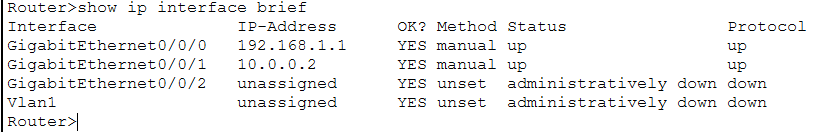
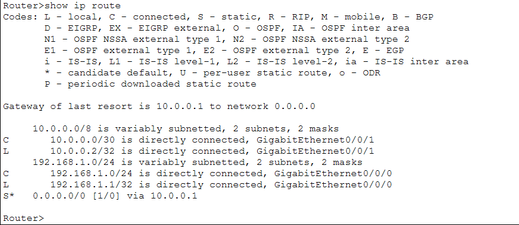
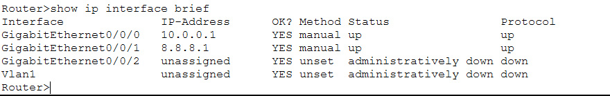
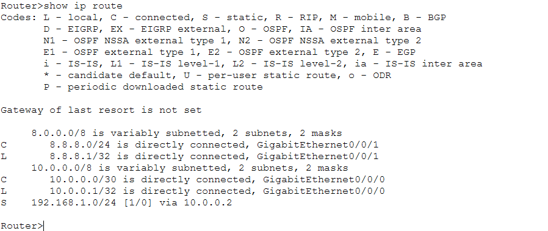
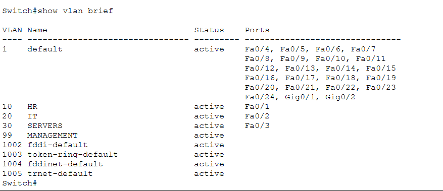

# Cisco Packet Tracer Networking Labs

A collection of progressively advanced networking labs built in Cisco Packet Tracer while studying Computer Networking.

## Lab Progression

| Lab Project | Concepts Covered | Date Completed | Topology |
| :--- | :--- | :--- | :--- |
| **Basic LAN** | Static IP, Layer 2 Switching | June 2026 | [View](images/basic-lan-topology.png) |
| **Secure SOHO** | Wireless, DHCP | June 2026 | [View](images/secure-soho-topology.png) |
| **Enterprise Gateway** | Default Gateways, L3 Routing | June 2026 | [View](images/enterprise-gateway-topology.png) |
| **Enterprise LAN/WAN** | ISP Connectivity, Public Routing | June 2026 | [View](images/enterprise-lan-wan-topology.png) |
| **VLAN Segmentation** | Broadcast Domains, L2 Isolation | June 2026 | [View](images/vlan-segmentation-topology.png) |

---

## Lab Spotlight: Enterprise LAN/WAN

### Overview
This lab connects a local office network to an ISP router, using a default route to give internal devices access to the public internet.

### Technologies Used
- Cisco Packet Tracer, Layer 2 Switching, Static Routing, Layer 3 Architecture, ICMP Troubleshooting
- IPv4 Addressing & Subnetting
- Static Routing (Gateway of Last Resort)
- DHCP Services
- WAN Transit Subnets

### Troubleshooting Log
* **Issue:** Devices inside the local network could not ping the ISP public server.
* **Root Cause:** Asymmetric routing. The ISP router received the packets but did not have a return route in its routing table for the local `192.168.1.0/24` subnet.
* **Resolution:** Added a static route (`ip route 192.168.1.0 255.255.255.0 10.0.0.2`) on the ISP router pointing back to the edge gateway to handle return traffic.

### Verification

#### EDGE-ROUTER
* **Interface Status:** 
  *Verified that all local LAN and WAN interfaces are up and assigned the correct IPs.*
* **Routing Table:** 
  *Verified the default route (`S*`) is active and pointing traffic out to the ISP.*

#### ISP-ROUTER
* **Interface Status:** 
  *Verified the public-facing and transit interfaces are operational.*
* **Routing Table:** 
  *Verified the static return route to the internal network is active, ensuring two-way communication.*

---

## Lab Spotlight: Department Segmentation with VLANs

### Overview
This lab separates HR, IT, and Server devices into different VLANs on a single switch to reduce broadcast traffic and prevent direct communication between departments.

### Technologies Used
- Cisco Catalyst 2960 Layer 2 Switch
- 802.1Q VLAN Mapping
- Broadcast Domain Isolation

### Troubleshooting Log
* **Issue 1:** CLI commands rejected with an "Invalid input detected" error marker.
* **Root Cause:** Attempted to run the `configure terminal` command while still in restricted User Exec Mode (`Switch>`).
* **Resolution:** Typed `enable` to move into Privileged Exec Mode (`Switch#`) first, which unlocked configuration access.

* **Issue 2:** The IT laptop and Company Server were not getting isolated correctly after initial configuration.
* **Root Cause:** The physical network cables were plugged into different switch ports than originally planned. The IT laptop was in port `Fa0/2` and the server was in `Fa0/3`.
* **Resolution:** Ran `show mac address-table` after sending traffic from the devices to map them to their actual physical ports. Updated the switch config to assign ports `Fa0/1`, `Fa0/2`, and `Fa0/3` to VLANs 10, 20, and 30 respectively.

### Verification

#### CORE-SWITCH
* **VLAN Database Initialization:** 
  *Verified that VLANs 10, 20, 30, and 99 were successfully created and active in the switch database.*
* **Port Assignments:** 
  *Verified that `Fa0/1` is assigned to HR (VLAN 10), `Fa0/2` to IT (VLAN 20), and `Fa0/3` to SERVERS (VLAN 30).*

### Testing Results (Layer 2 Isolation)
* **Cross-VLAN Ping Test:** 
  *Attempted to ping from HR-DESKTOP (192.168.10.2) to IT-LAPTOP (192.168.20.2). The ping timed out as expected, proving that Layer 2 isolation is working and the departments cannot communicate without a router.*

---

## Planned Labs
- [x] Basic LAN
- [x] Secure SOHO
- [x] Enterprise Gateway
- [x] Enterprise LAN/WAN
- [x] VLAN Segmentation
- [ ] Router-on-a-Stick (Inter-VLAN Routing)
- [ ] Access Control Lists (ACLs)
- [ ] NAT/PAT
- [ ] OSPF Routing
- [ ] Port Security
