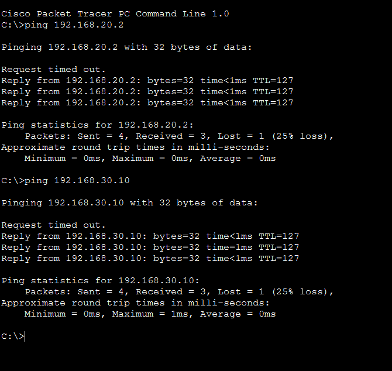

# Cisco Packet Tracer Networking Labs

A collection of progressively advanced networking labs built in Cisco Packet Tracer while studying Computer Networking.

## Lab Progression

| Lab Project | Concepts Covered | Date Completed | Topology |
| :--- | :--- | :--- | :--- |
| **Basic LAN** | Static IP, Layer 2 Switching | June 2026 | [View](images/basic-lan-topology.png) |
| **Secure SOHO** | Wireless, DHCP | June 2026 | [View](images/secure-soho-topology.png) |
| **Enterprise Gateway** | Default Gateways, L3 Routing | June 2026 | [View](images/enterprise-gateway-topology.png) |
| **Enterprise LAN/WAN** | ISP Connectivity, Public Routing | June 2026 | [View](images/enterprise-lan-wan-topology.png) |
| **VLAN & Inter-VLAN Routing** | 802.1Q Trunking, Sub-interfaces, ROAS | June 2026 | [View](images/roas-topology.png) |
| **Access Control Lists (ACLs)** | Security Boundaries, Extended ACLs, Packet Filtering | June 2026 | [View](images/acl-topology.png) |
| **Dynamic NAT / PAT** | NAT Overload, Private/Public Boundaries, Port Tracking | June 2026 | [View](images/nat-topology.png) |

---

## Lab Spotlight: Enterprise LAN/WAN

### Overview
This lab connects a local office network to an ISP router, using a default route to give internal devices access to the public internet.

### Technologies Used
- **Network Architecture:** Layer 2 Switching, Layer 3 Architecture, WAN Transit Subnets
- **Routing & Services:** Static Routing (Gateway of Last Resort), DHCP Services
- **Protocols & Analysis:** IPv4 Subnetting, ICMP Troubleshooting
- **Environment:** Cisco Packet Tracer, Cisco IOS CLI

### Troubleshooting Log
- **Issue:** Devices inside the local network could not ping the ISP public server.
  - **Root Cause:** Asymmetric routing occurred because the ISP router received packets but lacked a return route in its routing table for the local internal 192.168.1.0/24 subnet.
  - **Resolution:** Added a static route (ip route 192.168.1.0 255.255.255.0 10.0.0.2) on the ISP router pointing back to the edge gateway to properly handle outbound return traffic.

### Verification

#### EDGE-ROUTER
- **Interface Status:** 
  - Verified that all local LAN and WAN interfaces are up and assigned the correct IPs.
- **Routing Table:** 
  - Verified the default route (S*) is active and pointing traffic out to the ISP.

#### ISP-ROUTER
- **Interface Status:** 
  - Verified the public-facing and transit interfaces are operational.
- **Routing Table:** 
  - Verified the static return route to the internal network is active, ensuring two-way communication.

---

## Lab Spotlight: VLAN Segmentation & Inter-VLAN Routing (ROAS)

### Overview
This lab isolates HR, IT, and Server devices into distinct logical subnets (VLANs 10, 20, and 30) on a single switch to limit broadcast domains. It then utilizes a single physical trunk link to an upstream router (Router-on-a-Stick) to enable controlled, routable communication between those subnets.

### Technologies Used
- **Network Architecture:** Layer 2 Switching, Broadcast Domain Isolation, 802.1Q Virtual Local Area Networks (VLANs)
- **Routing & Services:** Router-on-a-Stick (Sub-interfaces), Inter-VLAN Routing
- **Protocols & Analysis:** IPv4 Subnetting, ARP Resolution, ICMP Verification
- **Environment:** Cisco Packet Tracer, Cisco IOS CLI

### Troubleshooting Log
- **Issue 1:** The show interface trunk command on the switch returned a completely blank output, and the link light between the switch and router remained red.
  - **Root Cause:** Cisco router ports are turned off via the shutdown state by default from the factory. Because the upstream interface was completely inactive, the switch port entered a disabled/non-connecting state and refused to initialize trunking negotiated behavior.
  - **Resolution:** Entered the router CLI and issued a no shutdown command on the physical interface to activate the link.
- **Issue 2:** The router CLI rejected sub-interface setup commands with an %Invalid interface type and number error.
  - **Root Cause:** Attempted to configure interface gig0/0.10, assuming standard 2911 interface naming conventions. The specific ISR router module installed uses a three-slot hardware mapping scheme (slot/subslot/port).
  - **Resolution:** Executed show ip interface brief to reveal the exact hardware name format (GigabitEthernet0/0/0). Adjusted configuration inputs to reference gig0/0/0.10 successfully.

### Verification

#### CORE-SWITCH
- **Port Trunking Status:**
  - Verified that Gig0/1 is successfully acting as an active 802.1Q trunk, allowing tagged frames from VLANs 10, 20, and 30 to pass up to the routing engine.

#### EDGE-ROUTER
- **Active Routing Table:**
  - Confirmed that virtual sub-interfaces Gig0/0/0.10, Gig0/0/0.20, and Gig0/0/0.30 are recognized by the IOS kernel as directly connected (C) and serving as the valid gateway endpoints for their respective subnets.

### Testing Results (Cross-VLAN Verification)
- **Successful Inter-VLAN Routing:** 
  - Executed cross-subnet diagnostic pings from HR-DESKTOP (192.168.10.2) to IT-LAPTOP (192.168.20.2) and COMPANY-SERVER (192.168.30.10). Initial packet drops occurred normally due to standard ARP resolution, followed by 100% continuous ICMP success responses routed via the sub-interfaces.

---

## Lab Spotlight: Access Control Lists (ACLs) & Network Security

### Overview
This lab implements network security boundaries at the distribution layer. Using an Extended Access Control List (ACL) applied at the Layer 3 boundary, the network blocks unauthorized lateral movement between departmental subnets while preserving necessary access to shared company resources.

### Technologies Used
- **Network Architecture:** Layer 3 Security Boundaries, Subnet Isolation
- **Routing & Services:** Extended Access Control Lists (ACLs), Inbound Traffic Filtering
- **Protocols & Analysis:** Wildcard Masking, ICMP Inspection, Packet Filtering
- **Environment:** Cisco Packet Tracer, Cisco IOS CLI

### Security Policies & Implementation
- **Policy:** Deny all traffic from VLAN 10 (HR) to VLAN 20 (IT) while preserving access to shared corporate resources hosted in VLAN 30 (Server Network).
- **Implementation:** An Extended IP Access List named BLOCK_HR_TO_IT was created and applied inbound on the HR VLAN 10 gateway interface (GigabitEthernet0/0/0.10). The ACL was applied inbound on the HR VLAN gateway (G0/0/0.10) so unauthorized traffic is filtered before being routed to other VLANs.

EDGE-ROUTER# show access-lists
Extended IP access list BLOCK_HR_TO_IT
    10 deny ip 192.168.10.0 0.0.0.255 192.168.20.0 0.0.0.255
    20 permit ip any any

### Troubleshooting Log
- **Issue:** The initial implementation failed, and HR devices were still able to ping the IT subnet successfully.
  - **Root Cause:** A standard subnet mask (255.255.255.0) was mistakenly entered instead of an inverse wildcard mask (0.0.0.255). Because Cisco IOS ACLs rely strictly on wildcard bits to define matching criteria, the engine misparsed the statement, leaving the traffic un-matched and un-blocked.
  - **Resolution:** Removed the misconfigured entry using no 10 inside the ACL sub-configuration menu and re-entered the statement using the proper inverse wildcard bits (0.0.0.255).

### Verification & Validation

#### Test 1: HR Desktop (192.168.10.2) -> IT Laptop (192.168.20.2)
- **Requirement:** HR users must not access IT devices.
- **Actual Result:** Failed (Returned Destination host unreachable from gateway).
- **Verification Proof:** 

#### Test 2: HR Desktop (192.168.10.2) -> Company Server (192.168.30.10)
- **Requirement:** HR users may access the company server.
- **Actual Result:** Success (100% ICMP echo replies received).

#### Test 3: IT Laptop (192.168.20.2) -> Company Server (192.168.30.10)
- **Requirement:** IT users may access the company server.
- **Actual Result:** Success (100% ICMP echo replies received).

---

## Lab Spotlight: Dynamic NAT with Port Address Translation (PAT)

### Overview
This lab expands the enterprise edge architecture by bridging the gap between private internal networks and the public internet. Implementing Port Address Translation (PAT / NAT Overload) allows multiple distinct internal VLAN subnets to securely share a single public-facing WAN IP address, conserving IPv4 address space while ensuring external connectivity.

### Technologies Used
- **Network Architecture:** Enterprise Edge Topology, Public/Private Boundaries, WAN Transit Subnets
- **Routing & Services:** Dynamic NAT, Port Address Translation (NAT Overload), Interface Mapping
- **Protocols & Analysis:** Transport Layer Port Tracking, ICMP Header Inspection, RFC 1918 IPv4 Traversal
- **Environment:** Cisco Packet Tracer, Cisco IOS CLI

### Implementation
To deploy PAT over the existing Inter-VLAN environment, internal sub-interfaces were designated as translation entry points, and the physical WAN port was designated as the exit boundary. A standard access list targets traffic originating from internal subnets for translation over the public interface.

Router# configure terminal
Router(config)# interface gig0/0/0.10
Router(config-subif)# ip nat inside
Router(config-subif)# interface gig0/0/0.20
Router(config-subif)# ip nat inside
Router(config-subif)# interface gig0/0/0.30
Router(config-subif)# ip nat inside
Router(config-subif)# exit
Router(config)# interface gig0/0/1
Router(config-if)# ip nat outside
Router(config-if)# exit
Router(config)# access-list 5 permit 192.168.10.0 0.0.0.255
Router(config)# access-list 5 permit 192.168.20.0 0.0.0.255
Router(config)# ip nat inside source list 5 interface gig0/0/1 overload

### Verification & Validation

#### 1. Outbound Internet Connectivity Verification
- **Test:** A diagnostic ping was initiated from HR-DESKTOP (192.168.10.2) across the edge boundary to the public ISP Gateway interface (10.0.0.1).
- **Result:** After an initial ARP/NAT timeout frame, continuous two-way ICMP communication was successfully established.
- **Verification Proof:** 

#### 2. NAT Translation Table Inspection
- **Command Executed:** Router# show ip nat translations
- **Analysis:** The translation table explicitly captures the PAT engine altering packet headers on the fly. Private Inside Local IP sockets are mapped dynamically to the single public Inside Global WAN interface address (10.0.0.2), tracking individual connections via unique transport-layer identifier numbers.
- **Verification Proof:** 

---

## Planned Labs
- [x] Basic LAN
- [x] Secure SOHO
- [x] Enterprise Gateway
- [x] Enterprise LAN/WAN
- [x] VLAN Segmentation & Router-on-a-Stick
- [x] Access Control Lists (ACLs)
- [x] Dynamic NAT / PAT
- [ ] OSPF Routing
- [ ] Port Security
